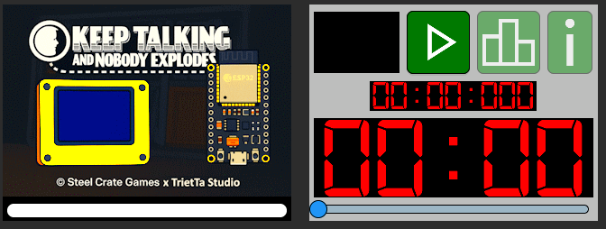
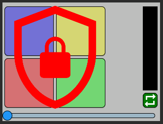

# 1. Tổng quan hộp thiết bị

> Mặt trước: 6 màn hình, gồm 1 màn hình chính (khởi tạo, cài đặt trò chơi), còn lại là các màn hình giải đố\

> Mặt sau: 6 màn hình giải đố\

> Mặt trái: 2 màn hình, gồm 1 màn hình tùy chỉnh ở trên (không phụ thuộc vào chức năng chính của thiết bị, có thể được lập trình độc lập), 1 màn hình ở dưới hiển thị thông tin thiết bị (cổng giao tiếp, số lượng pin, số seri, ...)\

> Mặt phải: Không có màn hình, chỉ có 1 công tắc bật/tắt thiết bị\

# 2. Các màn hình trên thiết bị
> Về cách sử dụng và thao tác trên các màn hình, hãy tham khảo tài liệu bổ sung [Comming soon]()

## 2.1. Màn hình chính
> Màn hình chính: Khởi tạo thiết bị, cài đặt thiết bị ban đầu từ người dùng trước khi bắt đầu trò chơi\

> Màn hình thông tin: Hiển thị thông tin thiết bị\

## 2.2. Các màn hình giải đố
Gồm 11 module chính, 3 module needy.\
Để xem mô tả chi tiết về các màn hình, hãy tham khảo tài liệu [Tiếng Anh](Game_docs/KeepTalkingAndNobodyExplodes-BombDefusalManual-v1.pdf) hoặc [Tiếng Việt](Game_docs/keep-talking-and-nobody-explodes-vi-v1.0.0.pdf)

### 2.2.1. Module chính
> Module Wires: Gồm có 6 dây, bên phải là nút cắt dây\

> Module The Button: Có 1 nút lớn và thanh màu sắc bên phải\

> Module Keypads: Có 4 nút nhấn lớn, mỗi nút hiển thị 1 ký tự ngẫu nhiên\

> Module Simon Says: Có 4 nút nhấn lớn với màu sắc khác nhau, thanh trạng thái bên phải, phía dưới có 1 nút nhấn nhỏ\

> Module Who’s on First: Có 1 màn hình hiển thị chữ lớn, bên dưới là 6 nút hiển thị các từ ngẫu nhiên, bên phải là thanh trạng thái\

> Module Memory: Có 1 màn hình hiển thị số lớn, bên dưới là 4 nút hiển thị các số ngẫu nhiên, bên phải là thanh trạng thái\

> Module Morse Code: Có 1 bóng đèn góc trái-trên, kế bên là màn hình hiển thị tín hiệu mã morse. Bên dưới là màn hình dò tần số với 2 nút nhấn trái phải. Cuối cùng là nút xác nhận tần số đã chọn\

> Module Complicated Wires: Có 6 dây với màu sắc khác nhau, mỗi dây có thể có 2 màu khác nhau. Phía trên mỗi dây là bóng đèn led, phía dưới mỗi dây là nhãn dán có hình ngôi sao. Cuối cùng là các nút nhấn cắt dây\

> Module Wire Sequences: Mỗi dây tương ứng với số 1-2-3 có thể kết nối với các điểm A-B-C. Bên phải là thanh trạng thái, bên dưới là nút cắt dây đã chọn\

> Module Mazes: Bên trái là màn hình lớn hiển thị mê cung ngẫu nhiên, bên phải là 4 nút nhấn di chuyển\

> Module Passwords: Gồm 5 chữ sắp sắp ngẫu nhiên, 2 phía trên-dưới mỗi ô chữ là các nút nhấn chuyển đổi chữ tiếp theo trong ô đó. Góc dưới cùng bên phải là nút nhấn xác nhận chữ đã chọn\

### 2.2.2. Module needy
> Module Venting Gas: Gồm 1 màn hình hiển thị thời gian đếm ngược, 1 màn hình hiển thị thông báo, 2 nút nhấn Y-N để xác nhận thông báo\

> Module Capacitor Discharge: Gồm 1 màn hình hiển thị thời gian đếm ngược, 1 thanh trạng thái bên trái, 1 biểu tượng Sét (nạp tụ điện), 1 biểu tượng Xuất (xả tụ điện), 1 cần gạt điều khiển xả tụ điện\

> Module Knobs: Gồm 1 màn hình hiển thị thời gian đếm ngược, 1 núm xoay ở chính giữa, 2 bên là dãy đèn led sáng ngẫu nhiên. Màn hình bên phải được sử dụng để đọc quy tắc sáng led\

# 3. Hình ảnh demo hoạt động của thiết bị
> Thiết bị đang hoạt động khi trò chơi đang diễn ra.\
Màn hình thời gian đếm ngược, các màn hình giải đố đang hiển thị, khi có 1 module bất kỳ được giải xong, sẽ xuất hiện dấu tick xanh.

> Khi toàn bộ module được giải hết, thời gian đếm ngược dừng lại và chuyển sang màn hình kết quả với thông báo "DEFUSED"\

> Khi phát sinh thao tác sai từ người dùng hoặc bộ thời gian đếm ngược về 0, thì chuyển sang màn hình kết quả với thông báo "EXPLODED" với tên module gây ra lỗi hoặc timeout\

# 4. Ưu/Nhược điểm, hướng phát triển của thiết bị
## 4.1. Ưu điểm
- Màn hình bố trí phù hợp theo chức năng, hiển thị trực quan
- Giao diện dễ thao tác và sử dụng theo hướng dẫn từ tài liệu

## 4.2. Nhược điểm
- Hộp thiết bị lớn, khó mang theo
- Sử dụng nguồn huyển đổi, chưa sử dụng pin
- Bố trí dây bên trong còn rối, khó bảo trì
- Xác suất có lúc tín hiệu bị chập chờn, phải bật/tắt lại nguồn

## 4.3. Hướng phát triển
- Thu nhỏ thiết bị để để mang theo
- Thiết kế cách đi dây gọn bên trong thiết bị
- Sử dụng pin, bên cạnh đó, vẫn có thể giữ nguyên nguồn chuyển đổi
- Tối ưu lại thuật toán xử lý tín hiệu để tránh chập chờn
