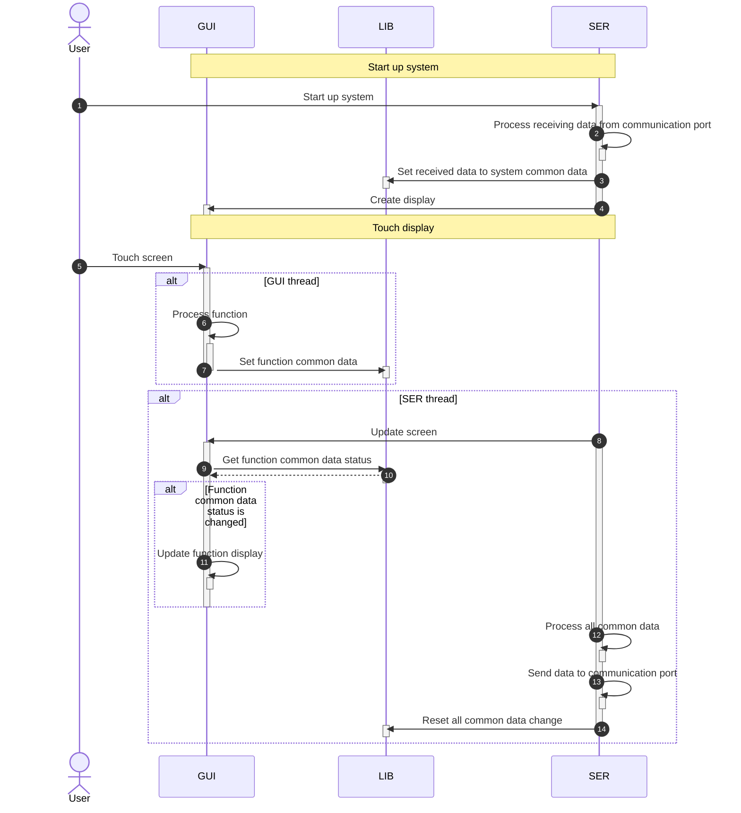
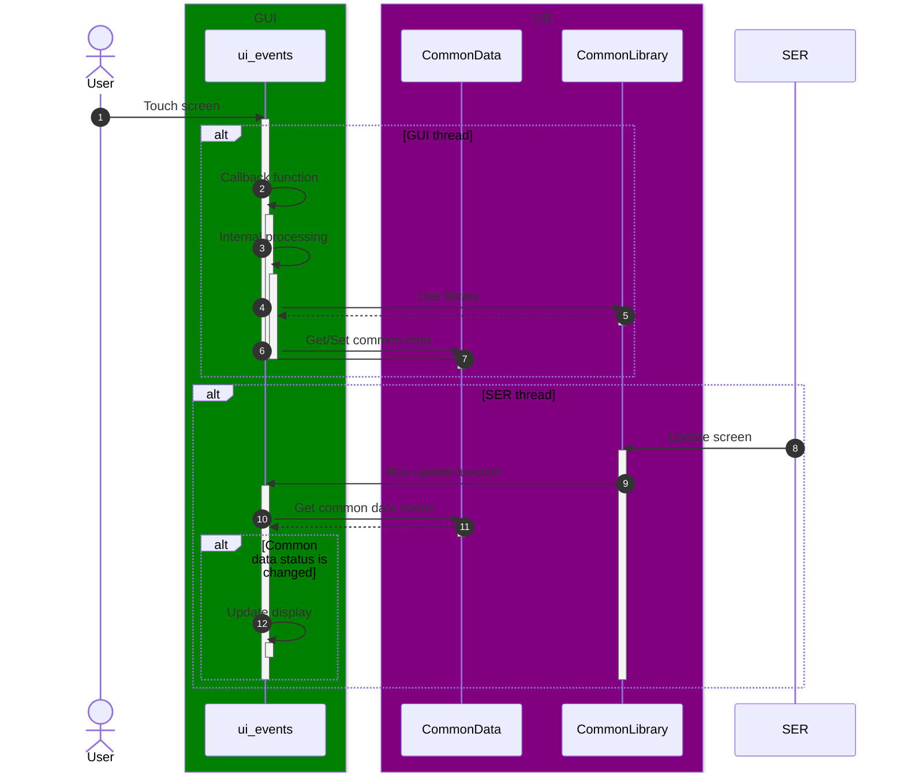
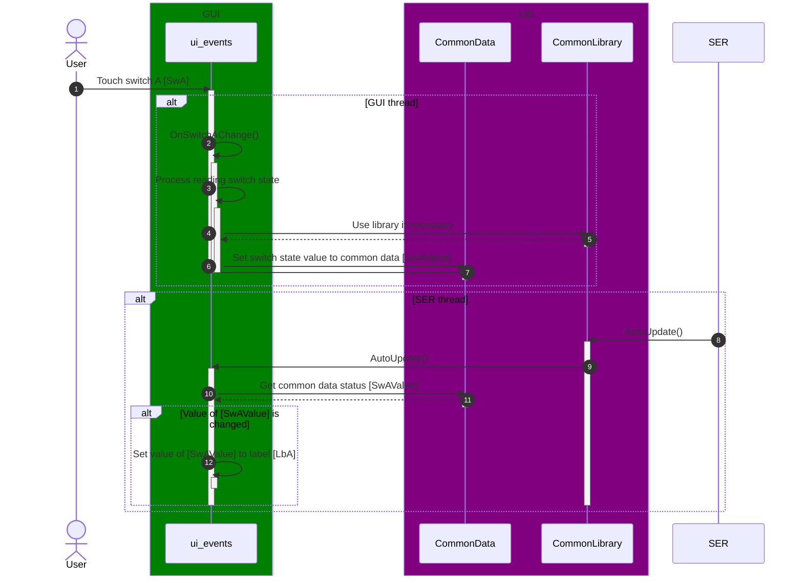
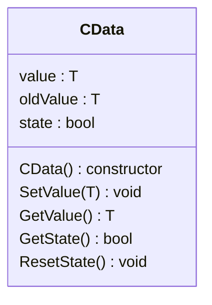
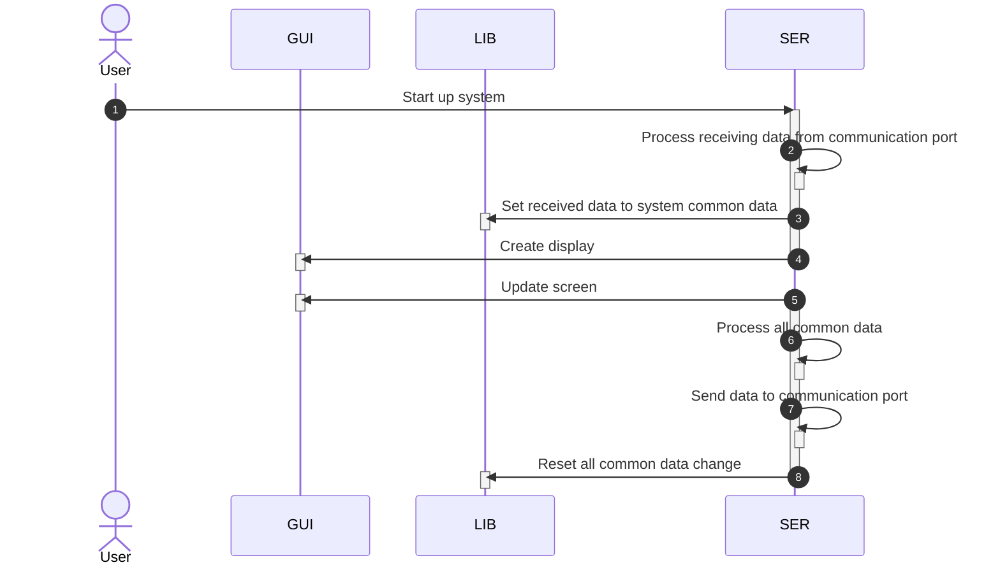

# 1. Tổng quan
## 1.1. Keep Talking and Nobody Explodes
Keep Talking and Nobody Explodes (viết tắt là KTANE) là một tựa game giải đố hợp tác độc đáo và đầy kịch tính, thách thức khả năng giao tiếp và làm việc nhóm của bạn dưới áp lực cao. Trò chơi đặt người chơi vào một tình huống căng thẳng: một người bị nhốt trong phòng với một quả bom phức tạp đang đếm ngược, trong khi những người chơi còn lại là "chuyên gia" sở hữu một cuốn sách hướng dẫn dày đặc thông tin về cách gỡ bom – nhưng họ lại không thể nhìn thấy quả bom! Để thành công, người gỡ bom phải mô tả chính xác những gì họ thấy trên bom (các module, dây nhợ, nút bấm, màn hình...) cho các chuyên gia nghe qua giao tiếp bằng lời nói, và các chuyên gia phải nhanh chóng tìm thông tin trong cuốn sách "Cẩm nang Gỡ bom" để hướng dẫn lại từng bước vô hiệu hóa từng module trước khi hết giờ. Mỗi màn chơi là một cuộc đua nghẹt thở với thời gian, đòi hỏi sự lắng nghe cẩn thận, truyền đạt rõ ràng và phối hợp nhịp nhàng, biến những khoảnh khắc căng thẳng tột độ thành những tràng cười sảng khoái hoặc những tiếng hét đáng nhớ khi bom (có thể) phát nổ.

Trang web chính thức của trò chơi: [https://keeptalkinggame.com/](https://keeptalkinggame.com/)

## 1.2. Cẩm nang Gỡ bom
Trong tựa game giải đố hợp tác đầy kịch tính này, cuốn "Cẩm nang Gỡ bom" (Bomb Defusal Manual) là một yếu tố then chốt, đóng vai trò là nguồn thông tin duy nhất và quan trọng nhất để hoàn thành mục tiêu.

Đây không chỉ là một tập tài liệu hướng dẫn thông thường, mà là "bộ não" chứa đựng toàn bộ quy tắc, quy trình và logic cần thiết để vô hiệu hóa mọi loại module phức tạp có thể xuất hiện trên quả bom. Cuốn cẩm nang này được thiết kế để chỉ dành cho những người chơi đóng vai trò "chuyên gia" – những người không nhìn thấy quả bom trên màn hình game. Thay vào đó, họ phải dựa hoàn toàn vào mô tả bằng lời nói của người chơi đang thao tác trực tiếp trên bom (người gỡ bom) để dò tìm thông tin tương ứng trong cẩm nang và chỉ dẫn lại cách thực hiện từng bước.

Cuốn cẩm nang bao gồm các phần chi tiết cho từng loại module, từ đơn giản đến phức tạp, như:
* **Module Dây điện:** Hướng dẫn cắt dây nào dựa trên màu sắc, số lượng dây và số sê-ri của bom.
* **Module Nút nhấn:** Quy tắc bấm nút dựa trên màu sắc, chữ trên nút và đèn báo.
* **Module Bảng ký hiệu:** Hướng dẫn chọn ký hiệu nào dựa trên việc tìm kiếm trong bảng tra cứu phức tạp.
* **Module Simon Says:** Yêu cầu ghi nhớ và lặp lại trình tự đèn nháy dựa trên màu sắc và số lần bị lỗi trước đó.
* **Module Morse Code:** Hướng dẫn giải mã tín hiệu Morse và tìm tần số tương ứng trong bảng.
* ... và nhiều loại module khác với các quy tắc riêng biệt.

Điểm đặc trưng của cuốn "Cẩm nang Gỡ bom" là tính chi tiết nhưng không trực quan. Nó được trình bày dưới dạng văn bản, sơ đồ, bảng biểu phức tạp, đôi khi cố tình gây nhầm lẫn hoặc yêu cầu sự suy luận cẩn thận. Người chuyên gia phải lắng nghe thật kỹ mô tả của người gỡ bom, nhanh chóng định vị đúng phần trong sách, hiểu các quy tắc và truyền đạt lại chỉ thị một cách rõ ràng, chính xác dưới áp lực thời gian đếm ngược.

Chính sự phân tách thông tin (bom trên màn hình - quy tắc trong sách) và yêu cầu giao tiếp không ngừng nghỉ với cuốn Cẩm nang Gỡ bom đã tạo nên trải nghiệm độc đáo, căng thẳng và đầy tính phối hợp của tựa game này. Nó biến một trò chơi giải đố cá nhân thành một bài kiểm tra tuyệt vời về khả năng làm việc nhóm, lắng nghe và xử lý thông tin dưới áp lực.

**Cẩm nang Tiếng Anh:** [Bomb Defusal Manual](https://www.bombmanual.com/)\
**Cẩm nang Tiếng Việt, được Việt hóa bởi Teefan:** [https://github.com/teefan/keep-talking-and-nobody-explodes-vi](https://github.com/teefan/keep-talking-and-nobody-explodes-vi)

## 1.3. KTANE Arduino
Lấy cảm hứng mạnh mẽ từ tựa game giải đố hợp tác kịch tính "Keep Talking and Nobody Explodes", chúng tôi đang phát triển một dự án độc đáo nhằm đưa trải nghiệm gỡ bom căng thẳng và hấp dẫn này ra khỏi màn hình máy tính để trở thành một thiết bị vật lý tương tác. Trọng tâm của dự án là mang các module gỡ bom đặc trưng của game lên nền tảng phần cứng phổ biến và linh hoạt: vi điều khiển ESP32 kết hợp với màn hình cảm ứng. Trên màn hình cảm ứng này, các module quen thuộc như cắt dây điện, giải mã nút nhấn, xử lý bảng ký hiệu, hay tương tác với màn hình hiển thị sẽ được tái hiện một cách trực quan, cho phép người chơi (đóng vai trò người gỡ bom) tương tác trực tiếp bằng cách chạm, vuốt hoặc nhập liệu. Thiết bị ESP32 này sẽ đóng vai trò là "quả bom" vật lý, hiển thị ngẫu nhiên các module cần xử lý, đòi hỏi người chơi phải mô tả chính xác tình trạng của bom cho "chuyên gia" (người giữ cuốn cẩm nang hướng dẫn, ở bên ngoài) để nhận được chỉ thị giải quyết. Dự án không chỉ là một bài tập kỹ thuật về lập trình nhúng, xử lý giao diện đồ họa trên phần cứng và tương tác cảm ứng, mà còn hướng tới việc tạo ra một trò chơi giải trí tương tác tuyệt vời cho các hoạt động team-building, thử thách bạn bè hoặc đơn giản là một sản phẩm DIY độc đáo dành cho những người yêu thích cả game lẫn điện tử.

> Màn hình cảm ứng điện trở

> Vi điều khiển ESP32 và các cổng ngoại vi

Tìm hiểu thêm: [ESP32 Cheap Yellow Display (CYD) Pinout (ESP32-2432S028R)](https://randomnerdtutorials.com/esp32-cheap-yellow-display-cyd-pinout-esp32-2432s028r/)

## 1.4. LVGL
LVGL (viết tắt của Light and Versatile Graphics Library) là một thư viện đồ họa mã nguồn mở và miễn phí, được thiết kế đặc biệt để giúp các nhà phát triển dễ dàng xây dựng giao diện người dùng đồ họa (GUI) đẹp mắt, hiện đại và mượt mà trên các hệ thống nhúng có tài nguyên hạn chế như vi điều khiển.

Điểm mạnh cốt lõi của LVGL nằm ngay trong tên gọi của nó:

- Light (Nhẹ nhàng): LVGL được tối ưu hóa để hoạt động hiệu quả trên các chip có bộ nhớ RAM và flash khiêm tốn, cũng như tốc độ xử lý không quá cao. Điều này làm cho nó trở thành lựa chọn lý tưởng cho các thiết bị nhúng giá rẻ hoặc năng lượng thấp.
- Versatile (Linh hoạt): Thư viện hỗ trợ rất nhiều loại màn hình khác nhau (bao gồm cả màn hình màu TFT, màn hình đơn sắc, màn hình e-paper...) và các thiết bị nhập liệu đa dạng (màn hình cảm ứng điện trở/điện dung, nút nhấn, encoder, bàn phím...). 

LVGL cung cấp một bộ sưu tập phong phú các đối tượng giao diện dựng sẵn (gọi là widget) như nút, nhãn, thanh trượt, biểu đồ, danh sách, vùng văn bản..., cùng với hệ thống styling mạnh mẽ cho phép tùy chỉnh giao diện theo ý muốn.
Hơn nữa, LVGL hoạt động độc lập với phần cứng và hệ điều hành, cho phép dễ dàng tích hợp vào nhiều nền tảng vi điều khiển khác nhau (như ESP32, STM32, RP2040, v.v.) và chạy trên cả môi trường bare-metal hoặc cùng với các hệ điều hành thời gian thực (RTOS) phổ biến. Sự hỗ trợ từ cộng đồng lớn mạnh và khả năng tương thích với các công cụ thiết kế GUI trực quan như Squareline Studio càng làm tăng tốc độ và hiệu quả trong quá trình phát triển.

# 2. Phần mềm
Dự án được xây dựng dựa trên kiến trúc phần mềm phân lớp, được thiết kế để tách biệt rõ ràng các trách nhiệm (separation of concerns) giữa hiển thị, logic xử lý, thư viện dùng chung và môi trường phát triển mô phỏng. Cấu trúc này bao gồm bốn thành phần chính: **GUI, LIB, SER,** và **SIM**.

1. **GUI (Graphical User Interface)**
    * **Trách nhiệm:** **GUI** chịu trách nhiệm hoàn toàn về khía cạnh hiển thị và tương tác với người dùng trên màn hình cảm ứng.
    - **Chức năng:** Sử dụng thư viện đồ họa **LVGL** để vẽ và quản lý tất cả các yếu tố hình ảnh của các module bom (nút, dây, màn hình, hiệu ứng...). Lắng nghe và xử lý các sự kiện đầu vào từ màn hình cảm ứng (chạm, vuốt, nhấn giữ...).
    - **Tương tác:** Khi người dùng thực hiện một thao tác (ví dụ: chạm vào nút, cắt dây ảo), **GUI** sẽ thu nhận sự kiện này và gửi một yêu cầu xử lý tương ứng đến lớp xử lý (thông qua **LIB** đến **SER** trên phần cứng hoặc **SIM** cho môi trường mô phỏng). **GUI** cũng nhận dữ liệu trạng thái cập nhật từ lớp xử lý để cập nhật lại hiển thị trên màn hình.

2. **LIB (Library)**
    - **Trách nhiệm:** **LIB** là thư viện chứa các hàm và cấu trúc dữ liệu cốt lõi, được thiết kế để dùng chung giữa lớp xử lý chính (**SER**) và môi trường mô phỏng (**SIM**), và có thể được sử dụng bởi **GUI** để định nghĩa cấu trúc dữ liệu.
    - **Chức năng:** Nơi tạo ra hệ thống câu đố, đáp án của trò chơi, đồng thời cũng chứa các xử lý kiểm tra quy tắc cho từng loại module gỡ bom. Các xử lý này sẽ nhận đầu vào là thao tác của người dùng và trạng thái hiện tại của module, trả về kết quả (ví dụ: thành công, thất bại, cần thao tác tiếp theo, ...).
    - **Tương tác:** Cả **SER** và **SIM** đều gọi các hàm trong **LIB** để xác định kết quả của một thao tác gỡ bom dựa trên các quy tắc đã định sẵn. **LIB** đóng vai trò như bộ não chứa luật chơi, tách biệt khỏi việc xử lý sự kiện (**SER/SIM**) và hiển thị (**GUI**).

3. **SER (Service)**
    - **Trách nhiệm:** **SER** là trung tâm xử lý dành cho phần cứng khi dự án chạy trên phần cứng **ESP32** thực tế.
    - **Chức năng:** Nhận các yêu cầu xử lý thao tác từ **GUI**. Lớp này không tự kiểm tra quy tắc gỡ bom, mà sẽ gọi các hàm kiểm tra tương ứng trong **LIB** để xác định kết quả của thao tác đó. Dựa trên kết quả từ **LIB**, **SER** sẽ cập nhật trạng thái nội bộ của quả bom và các module (ví dụ: đánh dấu module đã gỡ thành công, kích hoạt hiệu ứng nổ...).
    - **Tương tác:** Nhận yêu cầu từ **GUI**, gọi hàm trong **LIB**, cập nhật trạng thái nội bộ, và gửi dữ liệu trạng thái cập nhật trở lại cho GUI để hiển thị. **SER** chịu trách nhiệm tương tác với các tài nguyên phần cứng nếu cần (ví dụ: điều khiển đèn LED, âm thanh, mạng, ...).

4.  **SIM (Simulator)**
    - **Trách nhiệm:** **SIM** là môi trường mô phỏng hoàn chỉnh chạy trên máy tính (ví dụ: Visual Studio), được thiết kế để hỗ trợ phát triển **GUI** và các xử lý mà không cần phần cứng ESP32.
    - **Chức năng:** **SIM** thay thế hoàn toàn vai trò của **SER** trong môi trường phát triển. Nó hiển thị giao diện **GUI** (sử dụng **LVGL** được port cho PC) và nhận các yêu cầu thao tác từ **GUI** giống hệt như **SER** thật sẽ làm. Tuy nhiên, thay vì xử lý trên phần cứng ESP32, **SIM** sẽ giả lập quá trình xử lý bằng cách cũng gọi các hàm kiểm tra quy tắc trong **LIB**.
    - **Tương tác:** Giao tiếp với lớp **GUI** và sử dụng **LIB** tương tự như **SER**, nhưng hoàn toàn trong môi trường phần mềm trên máy tính. Giúp lập trình viên phát triển và debug **GUI** cũng như các xử lý của **LIB** một cách nhanh chóng, hiệu quả trước khi triển khai lên phần cứng ESP32.

**Lợi ích của Kiến trúc này:**

* **Phân tách trách nhiệm:** Mỗi lớp có một nhiệm vụ rõ ràng, giúp code sạch sẽ, dễ đọc và bảo trì.
* **Tái sử dụng code:** Logic cốt lõi trong LIB được sử dụng ở cả SER và SIM, tránh trùng lặp code.
* **Phát triển song song:** Có thể phát triển lớp GUI/SIM và lớp SER/Hardware một cách song song, tăng tốc độ dự án.
* **Dễ kiểm thử:** Việc tách biệt logic vào LIB giúp dễ dàng viết các unit test cho từng quy tắc gỡ bom. Môi trường SIM giúp kiểm thử GUI và luồng xử lý mà không phụ thuộc vào phần cứng.

# 3. Kiến trúc phần mềm
Dưới đây là kiến trúc tổng quan của hệ thống, ở các module khác nhau kiến trúc có thể thay đổi một chút, nhưng vẫn phải tuân theo kiến trúc gốc này.

| | **Trình tự xử lý khởi động thiết bị:** |
|-|-|
| 1  | Người dùng khởi động hệ thống. |
| 2 | Nhận dữ liệu từ chuẩn giao tiếp (sử dụng WiFi nội bộ cho ESP32 hoặc Window Message cho SIM để mô phỏng). |
| 3 | Set dữ liệu đã nhận vào dữ liệu dùng chung cho hệ thống (đồng hồ, số seri, số pin, ...), chi tiết dữ liệu dùng chung (common data) sẽ được viết chi tiết ở mục **Kiến trúc LIB**. |
| 4 | Khởi tạo và hiển thị giao diện trên màn hình. |

| | **Trình tự xử lý khi người dùng thao tác chạm trên màn hình:** |
|-|-|
| 5  | Người dùng chạm vào màn hình. |
| 6 | Xử lý hàm gọi (callback) tương ứng với thành phần GUI (textbox, button, slider, ...) mà người dùng chạm và sự kiện tương ứng của thành phần đó (press, release, click, slider change, ...). |
| 7 | Xử lý dữ liệu ở thành phần GUI và set dữ liệu vào dữ liệu dùng chung tương ứng với chức năng của thành phần GUI (giá trị màu sắc, số lượng, trạng thái ON/OFF, ...) |

| | **Trình tự xử lý cập nhật màn hình:** |
|-|-|
| 8  | SER gọi hàm cập nhật màn hình. |
| 9 | Lấy giá trị từ dữ liệu dùng chung ở tất cả thành phần GUI. |
| 11 | Cập nhật thành phần GUI tương ứng với dữ liệu dùng chung của thành phần đó nếu nó có sự thay đổi giá trị. |
| 12  | Xử lý giá trị cho tất cả dữ liệu dùng chung để chuẩn bị gửi dữ liệu qua chuẩn giao tiếp. |
| 13 | Gửi dữ liệu đã xử lý qua chuẩn giao tiếp. |
| 14 | Reset trạng thái thay đổi của tất cả dữ liệu dùng chung để chờ sự kiện tiếp theo từ người dùng. |

## 3.1. Kiến trúc GUI
Dựa theo kiểu trúc tổng quan, dưới đây là kiến trúc triển khai mã nguồn.

| | **Trình tự xử lý sự kiện chạm:** |
|-|-|
| 1  | Người dùng chạm vào màn hình. |
| 2 | Gọi hàm tương ứng với thành phần được chạm, tên hàm được đặt tên là `On<Component><Action>`, ví dụ: `OnSliderChange`, `OnButtonClick`, ... |
| 3 | Xử lý nội bộ các chức năng trong hàm. |
| 4 | Sử dụng thư viện cần thiết. |
| 6 | Xử lý get/set dữ liệu dùng chung liên quan đến chức năng đang xử lý. |

| | **Trình tự xử lý cập nhật màn hình:** |
|-|-|
| 8  | **SER** gọi cập nhật màn hình sau mỗi 10ms. |
| 10 | Get trạng thái thay đổi của dữ liệu dùng chung tương ứng với chức năng. |
| 12 | Cập nhật thành phần GUI tương ứng với dữ liệu dùng chung nếu nó có sự thay đổi giá trị. |

**Ví dụ:** Người dùng chạm vào switch A `SwA`, hiển thị giá trị ON/OFF của switch lên label A `LbA`.

## 3.2. Kiến trúc LIB
### 3.2.1. Kiến trúc dữ liệu dùng chung (Common data)
Common data là một đối tượng template lưu trữ một kiểu dữ liệu bất kỳ, có thể get/set giá trị và kiểm tra trạng thái thay đổi bởi giá trị trước đó và giá trị hiện tại.

Kiến trúc lớp của common data.

| Thành viên | Kiểu dữ liệu | Param | Mô tả |
|-|-|-|-|
| `value` | Bất kỳ | - | Giá trị hiện tại. |
| `oldValue` | Bất kỳ | - | Giá trị trước đó. |
| `state` | `bool` | - | Trạng thái thay đổi giá trị, bằng `true` khi `value` khác `oldValue`. Sau mỗi chu kỳ cập nhật màn hình, `oldValue` được set bằng `value` và `state` bằng `false`. |
| `SetValue(T)` | `void` | `param1`: giá trị cần set | Set giá trị hiện tại vào common data, xử lý so sánh giá trị và thay đổi biến trạng thái `state`. |
| `GetValue()` | Bất kỳ | - | Get giá trị hiện tại. |
| `GetState()` | `bool` | - | Get trạng thái thay đổi giá trị. |
| `ResetState()` | `void` | - | Được gọi sau mỗi chu kỳ cập nhật màn hình, thực hiện cập nhật `oldValue` bằng `value` và xóa trạng thái thay đổi của biến `state` thành `false`. |

**Các common data sử dụng cho toàn bộ hệ thống**\
Get/Set ở SER. Chỉ get ở những lớp kiến trúc khác.
| Tên | Kiểu dữ liệu | Mô tả |
|-|-|-|
| `LabelIndicator` | `LABEL_INDICATOR` | Nhãn đèn báo ngẫu nhiên, tham khảo "Phụ Lục A: Tham Khảo Cách Xác Định Đèn Báo" của "Cẩm nang Gỡ bom". |
| `BatteryType` | `BATTERY_TYPE` | Loại pin, tham khảo "Phụ Lục B: Tham Khảo Cách Xác Định Pin" của "Cẩm nang Gỡ bom". |
| `ComPortType` | `COMPORT_TYPE` | Loại pin ngẫu nhiên, tham khảo "Phụ Lục C: Tham Khảo Cách Xác Định Cổng Giao Tiếp" của "Cẩm nang Gỡ bom". |
| `SerialNum` | `std::string` | Dãy số seri ngẫu nhiên có 10 ký tự gồm chữ in hoa và số. |
| `BatteryNum` | `uint8_t` | Số lượng pin ngẫu nhiên từ 1-5. |
| `RandomSeed` | `uint32_t` | Hạt giống ngẫu nhiên được tạo khi khởi động hệ thống, tồn tại trong suốt chương trình, sử dụng cho việc tạo ngẫu nhiên hệ thống câu đố và cách giải đúng. |

**Cách tạo mới common data**
| Bước | File | Mô tả |
|-|-|-|
| 1 | - | Xác định kiểu dữ liệu cần tạo (enum, int, float, string, ...), nếu kiểu dữ liệu là class hoặc struct, hãy kiểm tra phải có đầy đủ các operator `=`, `==`, `!=`. |
| 2 | - | Xác định lớp trong kiến trúc sẽ sử dụng. `System data` dành cho việc đọc/ghi ở SER, `GUI data` dành cho việc đọc ghi ở GUI có giao tiếp với SER, `Custom data` dành cho việc xử lý các chức năng nội bộ. |
| 3 | CommonData.cpp | Tạo common data mới vào namespace của lớp kiến trúc đã xác định, đặt tên viết hoa từng từ, tạo object từ class `CData` kèm theo kiểu dữ liệu, ví dụ: `CData<uint8_t> SampleUInt8Data`, `CData<bool> SampleBoolData`, `CData<ENUM> SampleEnumData`. |
| 4 | CommonData.h | Sử dụng `extern` để xuất common data vừa tạo ra file .h để các lớp kiến trúc có thể sử dụng, ví dụ: `extern CData<uint8_t> SampleUInt8Data`, `extern CData<bool> SampleBoolData`, `extern CData<ENUM> SampleEnumData`. |

### 3.2.2. Thư viện dùng chung
Chứa các hàm sử dụng chung và riêng cho tất cả các lớp kiến trúc. `System library` dành cho toàn bộ hệ thống, `Custom library` dành cho xử lý chức năng nội bộ.

**Các hàm sử dụng cho toàn bộ hệ thống**
| Tên | Kiểu dữ liệu | Param | Mô tả |
|-|-|-|-|
| `Init()` | `void` | - | Khởi tạo giao diện, các giá trị ban đầu ở phía GUI, tạo ra hệ thống câu đố và cách giải đúng. |
| `AutoUpdate()` | `void` | - | Cập nhật màn hình sau mỗi chu kỳ 10ms. |
| `RandomRange(uint8_t, uint8_t)` | `uint8_t` | `param1`: giá trị đầu. `param2`: giá trị cuối. | Tạo một số ngẫu nhiên trong dãy từ `param1` đến `param2`, không lấy `param2`. |
| `GenerateSerialNumber()` | `std::string` | - | Tạo dãy seri ngẫu nhiên có 10 ký tự bao gồm chữ in hoa và số. |
| `VowelCheck(std::string)` | `bool` | `param1`: dãy seri | Kiểm tra nếu dãy seri có chứa nguyên âm thì trả về `true`, nếu không thì `false`. |
| `OddCheckAtLast(std::string)` | `bool` | `param1`: dãy seri | Kiểm tra nếu ký tự số cuối dãy seri là lẻ thì trả về `true`, nếu không thì `false`. |

## 3.3. Kiến trúc SIM/SER
### 3.3.1. Tổng quan
**SER** là lớp xử lý dữ liệu, chức năng ở phần cứng (ESP32). **SIM** là chương trình mô phỏng, thay thế cho ESP32 ở môi trường máy tính phục vụ cho quá trình phát triển phần mềm. **SIM** sử dụng **SER giả lập** **(dummy SER)** để mô phỏng lại quá trình khởi tạo hệ thống, giả lập chuẩn giao tiếp gần giống với phần cứng để get/set common data hệ thống, khởi tạo màn hình, hiển thị và lắng nghe sự kiện.\
**SER** và **dummy SER** về mặt thiết kế là tương đồng nhau về mặt xử lý do chúng sử dụng chung một kiến trúc tổng thể.\
Dưới đây là luồng hoạt động của SER.

| | **Trình tự xử lý của SER:** |
|-|-|
| 1 | Người dùng khởi động hệ thống. |
| 2 | Nhận dữ liệu từ chuẩn giao tiếp (sử dụng chuẩn I2C cho ESP32 hoặc Window Message cho SIM để mô phỏng). |
| 3 | Set dữ liệu đã nhận vào dữ liệu dùng chung cho hệ thống (đồng hồ, số seri, số pin, ...) |
| 4 | Khởi tạo và hiển thị giao diện trên màn hình. |
| - | Lắng nghe người dùng tương tác trên giao diện. |
| 5 | Xử lý cập nhật màn hình. |
| 6  | Xử lý giá trị cho tất cả dữ liệu dùng chung để chuẩn bị gửi dữ liệu qua chuẩn giao tiếp. |
| 7 | Gửi dữ liệu đã xử lý qua chuẩn giao tiếp. |
| 8 | Reset trạng thái thay đổi của tất cả dữ liệu dùng chung để chờ sự kiện tiếp theo từ người dùng. |

### 3.3.2. Kiến trúc Dummy SER
> Sẽ cập nhật sau

### 3.3.3. Kiến trúc SER
> Sẽ cập nhật sau

# 4. Kiểm thử đơn vị (Unit test)
Khi phát triển xong chức năng của một module, cần phải thực hiện kiểm thử để cover tất cả yêu cầu của module đó trong cuốn "Cẩm nang Gỡ bom".

| | **Quy trình kiểm thử đơn vị** |
|-|-|
| `Library unit test` | Kiểm thử thư viện đã phát triển, đảm bảo hoạt động đúng với yêu cầu của cuốn "Cẩm nang Gỡ bom". |
| `GUI unit test` | Kiểm thử giao diện người dùng, kết hợp với sử dụng thư viện, đảm bảo thao tác người dùng, hiển thị đúng với yêu cầu của cuốn "Cẩm nang Gỡ bom". |